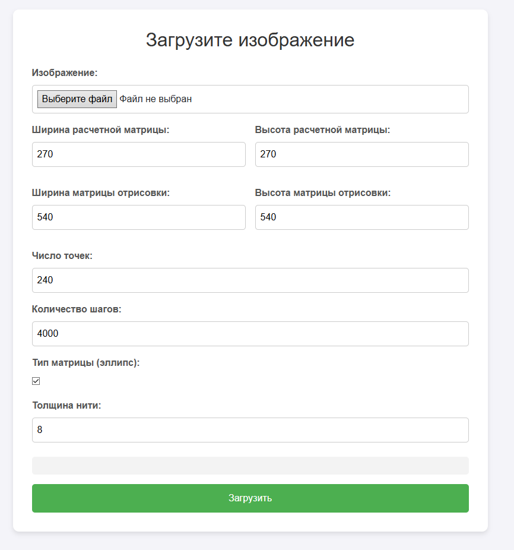
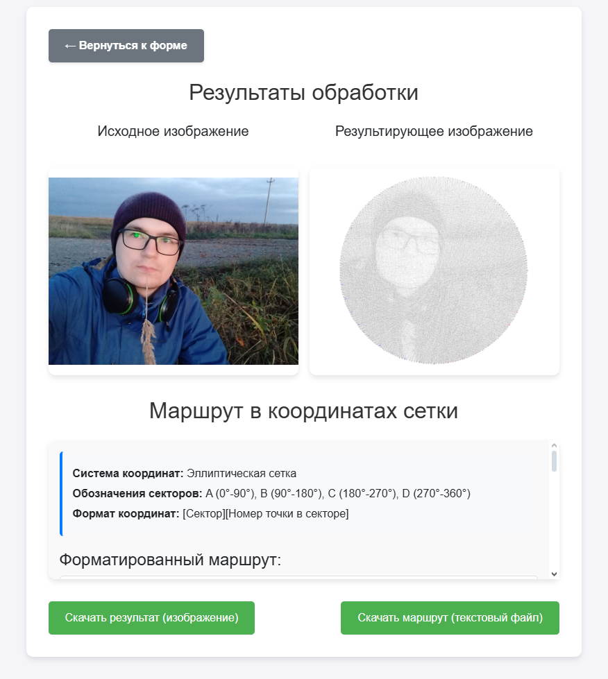

# Thread Art

An application for generating a route from straight lines that follows the original image.
The route is built between points on the edges of the canvas, which can be selected in the form of an ellipse or rectangle.
The application provides visualization of the result, a text description of the route in grid coordinates and the ability to download the results.

### Functionality
- **Image upload**: The user can upload an image for processing.
- **Parameter settings**:

- The sizes of the calculation and result matrices.
- The number of points on the edges of the canvas.
- The number of steps for building the route.
- Selecting the shape of the canvas (ellipse or rectangle).
- Setting the line thickness (thread).
- **Result visualization**: Displaying the original and processed images.
- **Formatted route**: Text representation of the route in grid coordinates (for example, `A1 → B2 → C3`).
- **Download results**: Ability to download the resulting image and text file with the route.
- **Processing progress**: Displays the image processing progress in real time.

### Technologies
- **Backend**: ASP.NET Core, SignalR (for real-time progress updates), SixLabors.ImageSharp (for image processing)
- **Frontend**: HTML, CSS, JavaScript, Bootstrap (for basic styling)

<div style="text-align: center;">


</div>

---
### Installation and Run

1. **Prerequisites**:
- Install the [.NET SDK](https://dotnet.microsoft.com/download) (version 6.0 or higher).
- It is recommended to use an environment such as Visual Studio or VS Code for development.
2. **Cloning a repository**:
```bash
git clone <repository-url>
cd thread-art
```
3. **Running the application**:
```bash
dotnet run
```
The application will be available at: `https://localhost:5001` (or `http://localhost:5000`).
4. **Configuration (optional)**:
- File cleaning parameters can be changed in the `appsettings.json` file (the `FileCleanup` section).

---
### User Guide

1. **Uploading an image**:
- Go to the main page of the application.
- Click "Choose file" and upload an image.
2. **Configuring parameters**:
- Specify the matrix sizes, number of points, steps, and other parameters.
- Select the canvas shape (ellipse or rectangle).
3. **Start processing**:
- Click the "Download" button.
- Monitor the processing progress in real time.
4. **View results**:
- After processing is complete, the original and resulting images will be displayed.
- The route in grid coordinates will be shown below.
5. **Download results**:
- Use the "Download result (image)" and "Download route (text file)" buttons to save the results.
6. **Return to form**:
- Click "← Return to form" to start a new processing.

Notes:
- For large images or complex parameters, processing may take some time.
- The processing results are temporarily stored on the server and are automatically deleted after a specified period of time.
